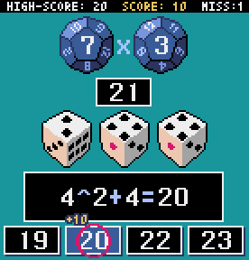

# 計算ダイス

[マスダイス](https://www.play-departmentstore.com/fs/castjapan/tf006)を参考にしました。

## 操作方法

* キーボード又はマウスを使って操作します。
* 使用するキーは、次の4つのどれでも可能です。
  * 【Z】【X】【C】【V】
  * 【1】【2】【3】【4】
  * 【←】【↑】【→】【↓】

## 遊び方

* 12面体のダイス2個を振ります。
* 出た2つの数字を掛け合わせた数がターゲットナンバーです。 
* 次に6面体のダイス3個を振ります。
* 出た数字を一度ずつ用いて、足し算、引き算、掛け算、割り算、べき乗の組み合わせで、ターゲットナンバーに最も近い数を当てます。
* 2回間違えると終了です。
* 回答が早いほど高得点です。
* SHIFTキーを押しながらスタートすると、加減乗除のみとなります。
